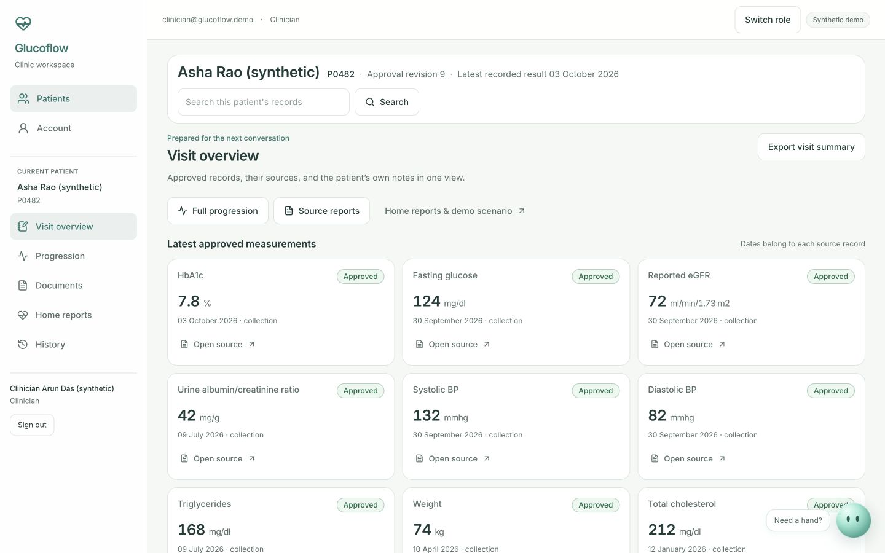

# Glucoflow

A shared workspace for patients and clinic teams to turn scattered diabetes records into a reviewed, source-backed history. Upload a report, check the extracted draft against the original, approve it, and explore the published timeline.

**[Open the hosted demo](https://glucoflow.vercel.app)** · [Setup guide](app/docs/SETUP.md) · [Demo walkthrough](app/docs/DEMO.md) · [Android APK](https://github.com/wysh3/glucoflow/releases/download/demo-2026-10-04-chat/Glucoflow_Android.apk)



## What it does

- **Patient workspace:** try built-in synthetic samples, upload PDFs or ordered photos, open original reports, view approved records, add patient-reported notes, and export a visit summary.
- **Gluco record companion:** an expressive animated orb with bounded GPT‑6 Luna conversation planning, patient-scoped record summaries, follow-up questions and original source links. Recorded facts stay separate from patient-reported entries; clinical advice remains out of scope.
- **Clinic workspace:** consolidated visit overview, source-backed latest measurements, prescriptions, examinations and patient notes; review extracted drafts beside source evidence, correct fields before publication, explore progression, search records, and retain amendment history.
- **Synthetic Master dashboard:** illustrative multi-year measurements and medication phases, home glucose/symptom entries, clinician-configured screening tracking, manual care categories, and an append-only demo SOS snapshot inbox.
- **Shared web and Android experience:** one React client packaged with Capacitor, with separate patient and clinic permissions enforced on the server and in PostgreSQL.
- **Two extraction modes:** a labelled deterministic fixture engine for local demos and an optional live model adapter with explicit call/token/cost limits. Model output remains a draft until human approval.

The live demo includes the warm clinical interface, desktop/mobile navigation, editable note corrections and a built-in synthetic sample library. Choose **Clinic team → Try a sample report → Upload lab sample** to start without finding a document. Demo SOS creates a snapshot for the synthetic clinic inbox; it does not dispatch emergency services. Configured flags and categories are for human review. Glucoflow does not diagnose, recommend treatment, infer missing measurements, or integrate live ABHA/ABDM.

## Stack

| Layer | Implementation |
| --- | --- |
| Web and Android | Vite, React, TypeScript, Tailwind, Radix/shadcn primitives, Capacitor |
| API | Fastify with authenticated, tenant-scoped routes |
| Processing | Separate Node worker, durable jobs, PDF/image preparation and OCR |
| Data | PostgreSQL with row-level security, Supabase Auth and private Storage |
| Hosted demo | Vercel frontend; Azure Container Apps API/worker; Supabase database/auth/storage |
| Verification | Vitest, SQL isolation checks, Playwright desktop/mobile workflows |

## Run locally

Prerequisites: **Node.js 22.12–22.x**, **pnpm 12.5.1**, and **PostgreSQL 16** binaries on your PATH. The local database helper also discovers Homebrew PostgreSQL. Android builds additionally need JDK 21 and Android SDK 36.

```bash
git clone https://github.com/wysh3/glucoflow.git
cd glucoflow/app
pnpm install --frozen-lockfile
cp .env.example .env
pnpm db:start
pnpm db:migrate
pnpm fixtures:generate
pnpm fixtures:reference
pnpm seed:demo -- --clinic demo --confirm-demo
pnpm dev
```

Open **http://127.0.0.1:5173**. The API runs at **http://127.0.0.1:8787**. Local demo credentials are generated in `app/.local/demo-credentials.json`; the dev server can use these to show role-entry buttons. This file and `.env` are ignored by Git. The default local extraction mode uses labelled synthetic fixtures and requires no model key.

Use these database and seed commands only with the local development database. They are not the hosted bootstrap procedure. See the [full setup guide](app/docs/SETUP.md) for database roles, signing and model configuration, and [hosted operations](app/docs/HOSTED.md) for deployment details.

## Verify

Run from `app/` after setting up the local database and demo accounts:

```bash
pnpm typecheck
pnpm test
pnpm db:test
pnpm build
pnpm e2e
pnpm smoke
```

The API and worker must be running for `pnpm smoke`. Playwright starts or reuses local services. Integration and browser tests create synthetic records; avoid pointing them at a real patient database.

The 4 October 2026 record-companion pass verified both TypeScript projects, **180 tests across 29 files**, **12 SQL isolation/constraint checks**, **88 desktop/mobile browser checks**, and production builds. Eight focused chat checks additionally verify the final message visibility, readable reply scrolling, motion accessibility, patient scope, error recovery and source opening. See the [record chat verification report](app/reports/record-chat-2026-10-04.md) and [assistant capabilities and limits](app/docs/APP_GUIDE.md). The build currently reports a large frontend bundle warning.

The earlier [hosted deployment report](app/reports/hosted-deployment-2026-10-03.md) documents a synthetic upload → live extraction → review → approval → export flow. It is historical evidence for that deployed revision, not a clinical accuracy claim or verification of every subsequent edit.

## Repository layout

```text
app/
  apps/client/         Shared web UI and Capacitor Android project
  apps/api/            Authentication, records, uploads, review and exports
  apps/worker/         Document processing and export jobs
  packages/            Contracts, domain rules, data, extraction and UI
  supabase/            Additive migrations and SQL checks
  scripts/             Local setup, seed, evaluation and verification
  tests/               Integration and browser workflows
  docs/                Setup, demo, deployment and decisions
  reports/             Measured results and screenshots
docs/mvp/              Original scope, architecture and acceptance baseline
docs/superpowers/      Revised dashboard implementation plan
deliverables/          Android APK, pitch decks and submission drafts
```

## Status and limitations

This is a hackathon prototype using synthetic records. Hosted authentication, private source access and live processing have dated verification evidence. Physical-device camera/session/export checks, phone OTP, independent extraction validation and clinical/productivity outcomes remain pending. The included signed APK contains the current shared client. Physical-device behavior still needs independent verification. Submission decks and answers are drafts; their claims require reconciliation with the dated evidence before external submission.

For detailed context, see the [acceptance mapping](app/reports/acceptance.md), [product specification](docs/mvp/01-product.md), [revised dashboard plan](docs/superpowers/plans/2026-10-03-pdf-demo.md), and [implementation decisions](app/docs/DECISIONS.md).

No license has been selected for this repository.
