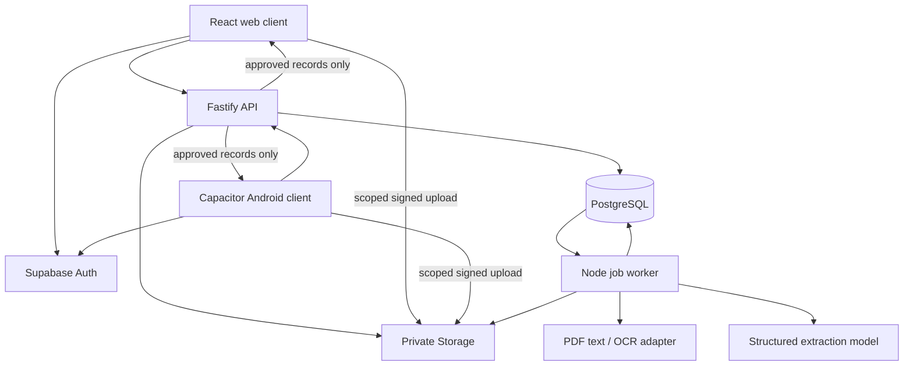

# System architecture

## Decision

Use a pnpm TypeScript monorepo with one Vite/React frontend for web and Capacitor Android. Use Fastify for authenticated APIs and a separate Node worker process for documents and exports. Supabase supplies Auth, PostgreSQL and private Storage. Vercel serves frontend assets. Railway runs API and worker containers.

This supersedes the earlier Next.js proposal because the user now requires both roles on web and Android with the same web component system. Server rendering provides little benefit to an authenticated records workspace. Native React Native would require a second component implementation for shadcn and the requested animated icons. A simple remote-URL WebView would depend on the website for its shell; bundle assets in the APK instead.

## Components



The database job queue is the single orchestration mechanism. No LangGraph, vector database, Redis or general-purpose multi-agent framework is needed for this workflow.

## Repository map

```text
apps/client/                 Vite SPA, React Router, Capacitor android/ project
apps/api/src/               Fastify routes, authentication, authorization
apps/worker/src/            document/export jobs and queue lifecycle
packages/contracts/src/     Zod schemas and shared DTOs
packages/domain/src/        review, versioning and validation rules
packages/data/src/          scoped queries and transactional operations
packages/extraction/src/    evidence extraction and provider adapters
packages/ui/src/            shadcn wrappers, tokens, icons
supabase/migrations/        tables, constraints, grants and RLS
supabase/tests/             isolation and transactional tests
fixtures/synthetic/         source PDFs/images and independent labels
scripts/                    seed and local operational commands
tests/e2e/                  browser workflow and permissions scenarios
```

Keep business authorization on the server and database. Shared UI types improve consistency but cannot enforce access.

## Request and upload sequence

1. Supabase authenticates the user. API verifies access token signature, issuer, audience and expiry against configured project keys. The actor ID comes from the verified token.
2. API resolves active clinic membership or explicit patient-account link. It authorizes the requested patient.
3. API creates an upload session and object-scoped signed upload URLs for the declared file manifest. The caller cannot choose arbitrary storage paths. Supabase upload tokens last two hours; the application completion window is 15 minutes. See the explicit lifetime distinction in the API specification.
4. Client uploads to private Storage and calls complete. API reauthorizes completion and checks all manifest objects; worker independently checks content magic, size, page count and checksum before extraction.
5. A database transaction marks the upload complete and inserts one unique processing job. If the client retries, it receives the same job reference.
6. Worker leases the job, downloads to bounded temporary storage, extracts drafts, validates and persists results. API returns observed job stages to authorized polling clients.
7. Reviewer publishes using a revision-checked transaction. Timeline and export read the committed approved snapshot only.

Polling is every 2 seconds while a relevant screen is visible and a task is active, backing off to 10 seconds after 30 seconds. Stop on logout, terminal state or hidden app. Refetch on resume. Realtime is deferred.

## Durable job contract

`jobs` stores kind, document/export ID, stage, state, attempt, available_at, lease_until, lease_token and error_code. Workers claim through a transaction with `FOR UPDATE SKIP LOCKED`. Lease duration 60 seconds, heartbeat every 15 seconds. Every write checks the lease token to fence off an expired worker. Stage outputs use unique document/version/stage keys. A restarted worker resumes from durable output.

Retry transient timeouts, 429 and 5xx responses at most three total attempts, with jitter and 5/20 second baseline delays, respecting Retry-After. Do not retry invalid file formats, identity holds or unsupported documents. Exhausted jobs become failed with an actionable retry control. User retry creates a new run linked to the same document, reusing validated preprocessing. Enforce a configurable hard provider-call and token budget per document.

This is at-least-once execution with idempotent effects, not a promise of exactly-once provider billing.

## Shared client

React Router owns the routes on both platforms. TanStack Query owns server state; form state remains local. Small UI-only stores may hold selected chart test and drawer state. Do not mirror the database into a global client store. Cache keys include actor and active clinic/patient. Clear query state on role change and logout.

Capacitor bundles the built `dist` directory and connects to the same HTTPS API. APK contains public configuration only. Browser origin and Capacitor origin are explicit CORS entries. Camera uses the Capacitor Camera plugin; file picker supports PDFs. Android and web use the same DTOs and validation messages.

## Export

Export is a queued server job against a fixed approval revision. Generate PDF from structured data using a server PDF library, with recorded values, care entries, source filename/page references, a frozen set of note versions, data cutoff and synthetic label when applicable. Do not export unreviewed drafts. Store it privately and return an expiring download URL. Clicking Open source inside the application reauthorizes access; do not embed long-lived bearer links in exported PDFs.

## Dependencies and versions

At scaffold time resolve current compatible stable versions and commit the exact lockfile. Pin the Node LTS version in repository/tooling. Use TypeScript strict mode, Zod, Vitest and Playwright. Do not assume all newest major versions are mutually compatible. Verify the Capacitor/Android SDK/JDK requirements from official docs before the Android build.

## References checked 2 October 2026

- [Capacitor](https://capacitorjs.com/docs): web application packaging and native APIs.
- [Camera plugin](https://capacitorjs.com/docs/apis/camera): camera integration.
- [Fastify](https://fastify.dev/docs/latest/Guides/Getting-Started/): API framework.
- [Railway Fastify deployment](https://docs.railway.com/guides/fastify): deployment route.
- [Supabase RLS](https://supabase.com/docs/guides/database/postgres/row-level-security): database authorization.

## Patient-scoped retrieval

Use PostgreSQL full-text search plus a small versioned alias map over approved fact labels, approved evidence quotes and visible document metadata. No vector store or language-model query planner is needed. Require the same patient/clinic authorization as timeline access before retrieval; snippets and counts must never leak inaccessible documents. The search function returns source references, not generated medical explanations.

Publication updates searchable approved content in the same transaction or through a view over the committed approved tables. An asynchronous index must not expose draft data or lag behind access revocation. Search originals via source opening; do not index all raw OCR text into the patient-visible search surface.

## Processing libraries and rendering

Use PDF.js for PDF text and page rendering with a compatible Node canvas adapter, Tesseract.js for bounded OCR jobs, Sharp for image orientation/resize, Recharts for the native web charts, and PDFKit for server PDF summaries. Keep all versions compatible and locked at scaffold time. None of these libraries interprets medical results. Native module packaging for the canvas adapter and Sharp is a required worker-container smoke test.

Publication is a database stored procedure with a fixed search_path, explicit actor membership checks and one transaction. The API role cannot directly insert/update approved facts, approval batches or audit events. All mutation procedures write their own audit record. RLS still scopes reads. This enforces the approval boundary independently of a route handler.
